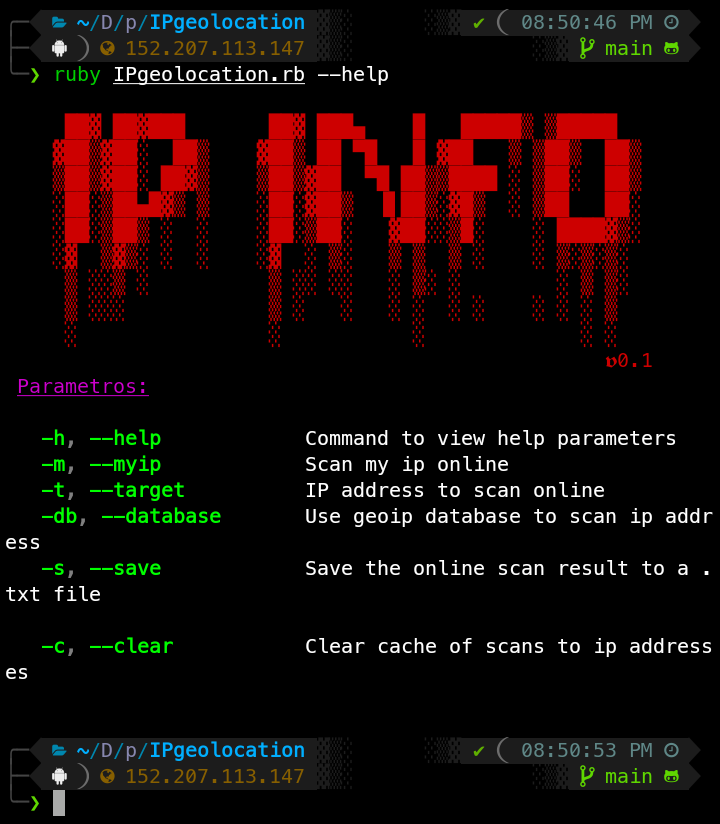

# IPgeolocation

[`IPgeolocation.com`](https://github.com/BreakerBox/IPgeolocation.git)

This is the official Ruby client library for the [`IPinfo.io`](https://ipinfo.io) IP address API, allowing you to lookup your own IP address, or get any of the following details for an IP:

This script is an ip geolocation tool programmed in ruby ​​by [`BreakerBox`](https://github.com/BreakerBox), I hope you like it.
# GitHub Stats

# Installation

### Required gems
 - [base64](https://github.com/ruby/base64)
 - [ipinfo](https://github.com/ipinfo/ruby)
 - [geoip](https://github.com/cjheath/geoip)
 - [paint](https://github.com/janlelis/paint)
 - [ruby_figlet](https://github.com/Demonstrandum/RubyFiglet)
 - [fileutils](https://gist.github.com/jensendarren/e78b464a5b21e58faa29)
 - [httpclient](https://github.com/nahi/httpclient)
 - [open3](https://github.com/ruby/open3)
 - [ipaddr](https://github.com/ruby/ipaddr)
### Installation in termux

> $ **apt update**

> $ **apt upgrade**

> $ **apt install git**

> $ **apt install ruby**

> $ **git clone https://github.com/BreakerBox/IPgeolocation.git/**

> $ **cd IPgeolocation**

> $ **bundle install --gemfile=requirements.rb**

> $ **ruby IPgeolocation.rb --help**

### Installation in others

> $ **git clone https://github.com/BreakerBox/IPgeolocation.git/**

> $ **cd IPgeolocation**

> $ **bundle install --gemfile=requirements.rb**

> $ **ruby IPgeolocation.rb --help**

# Usage

---
# Version
## IPgeolocation

## Ruby

# License

Este proyecto está bajo la Licencia (GNU GENERAL PUBLIC LICENSE) - mira el archivo [LICENSE](LICENSE) para detalles/

